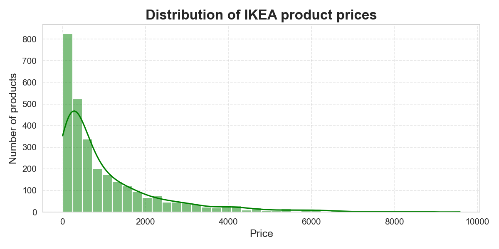
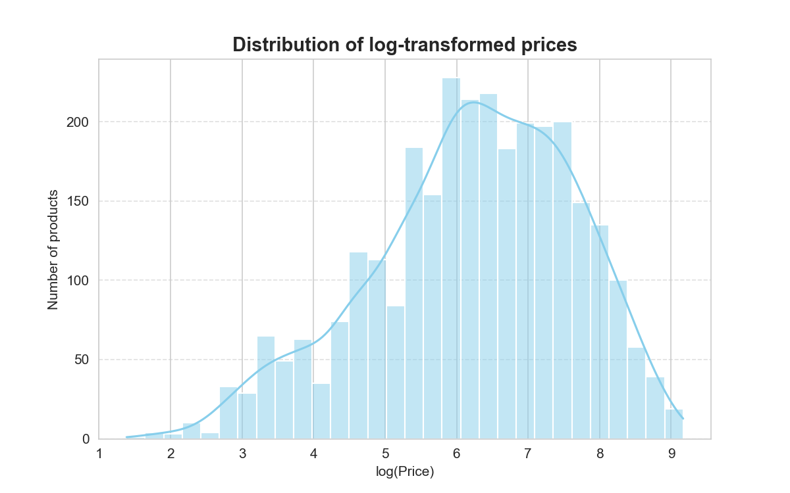
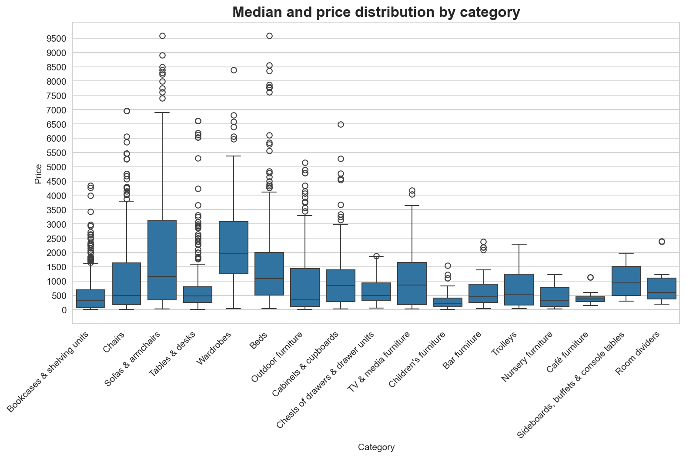
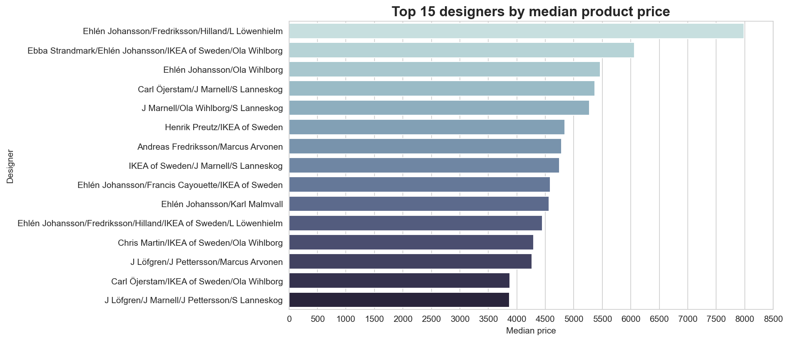
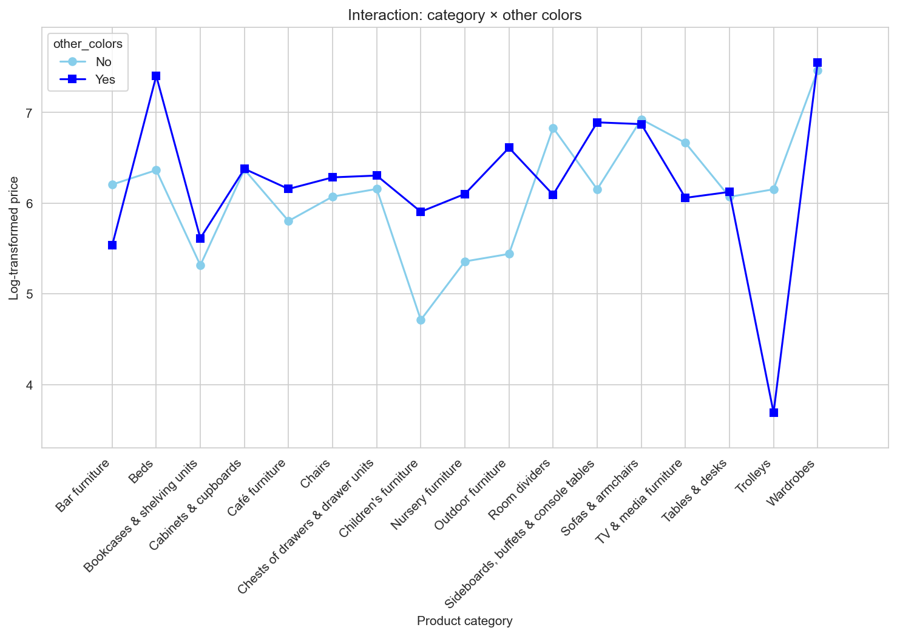
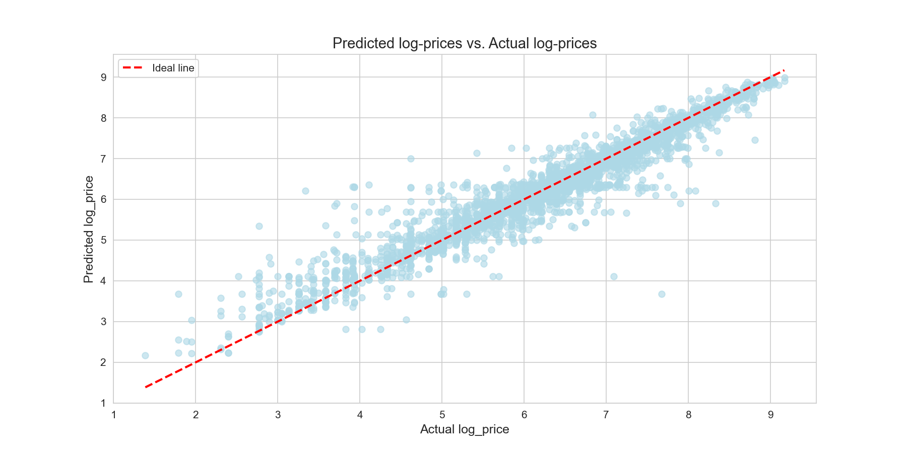

# Furniture Price Prediction

## Project Overview
This project predicts furniture prices based on product characteristics using Python and machine learning.  
Goal: demonstrate structured data analysis, feature engineering, model building, and actionable insights from the results.

## Dataset
- Source: https://raw.githubusercontent.com/rfordatascience/tidytuesday/master/data/2020/2020-11-03/ikea.csv    
- Size: 3694 records, 14 original columns
- Key features:
  - price — product price in USD (target variable)
  - category — product category
  - width, height, depth — physical dimensions of the product
  - designer — product designer(s)
  - other_colors — availability of alternative color options 

## Technologies & Libraries
- Python 3.x
- pandas, numpy
- matplotlib, seaborn
- scikit-learn
- Jupyter Notebook 

## Project Workflow
1. Data cleaning and exploratory data analysis (EDA)
2. Hypothesis formulation and statistical testing (ANOVA, Tukey HSD, T-test, Mann-Whitney)
3. Feature engineering and data preparation
4. Model training, tuning, and evaluation
5. Results visualization and interpretation  

## Key Results & Insights
- Predicted furniture prices using RandomForestRegressor with R² = 0.815 on the test set
- Main price drivers: product width, designer, depth, and height
- Price distribution is highly skewed; log transformation stabilized the distribution and reduced the influence of outliers
- Statistical tests confirmed:
  - Effect of additional color options depends on product category
  - Certain designers are systematically associated with higher prices
- Predicted vs actual values show that the model captures overall trends well, with stable predictions across most categories and designer groups
- Minor discrepancies occur for rare combinations of category and designer with few products 

## Visuals

Price distribution before log transformation, showing skewed prices with many outliers

Price distribution after log transformation, showing more balanced variance

Median and range of prices by category, highlighting price skew and outliers

Top 15 designers by median product price, showing which designers produce more expensive furniture

Price distribution for products with/without alternative colors, showing effect on pricing

Predicted vs actual furniture prices using RandomForestRegressor, showing model accuracy

## How to Run

1. Clone the repository:
   git clone https://github.com/kkkyarova/Furniture-Price-Prediction.git

2. Install dependencies:
   pip install -r requirements.txt

3. Open the Jupyter Notebook:
   jupyter notebook notebook/furniture_price_prediction.ipynb

## Next Steps (Optional)
- Try other regression models or hyperparameter tuning
- Consider adding features or external data for better predictions

## Author

Yarova Kateryna

GitHub - https://github.com/kkkyarova

